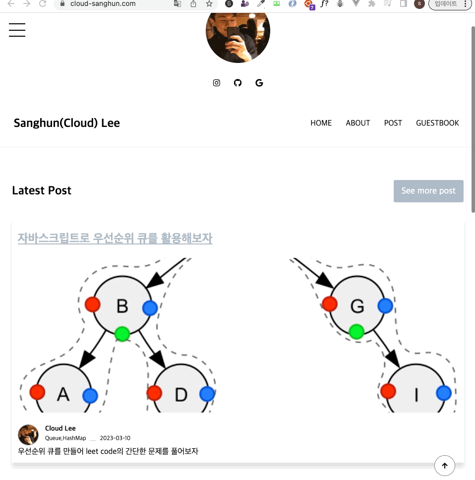
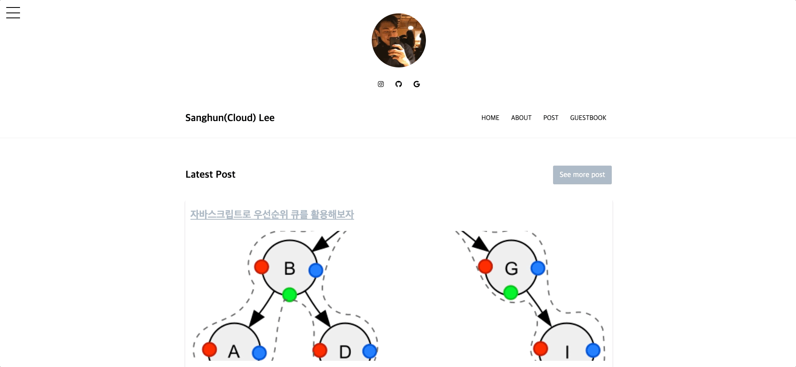
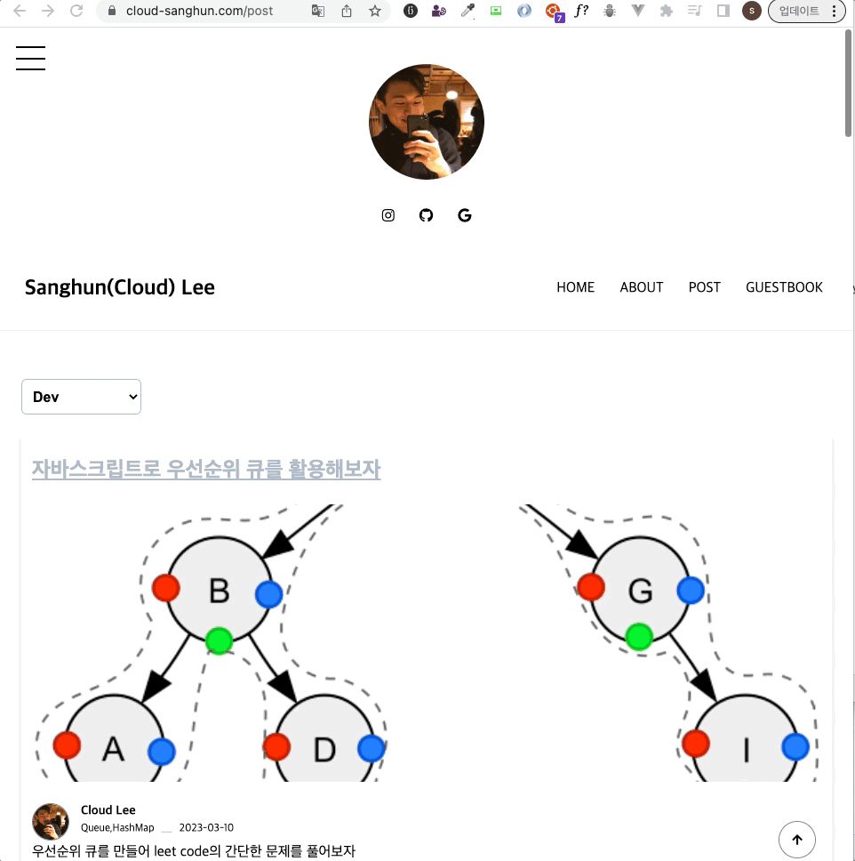
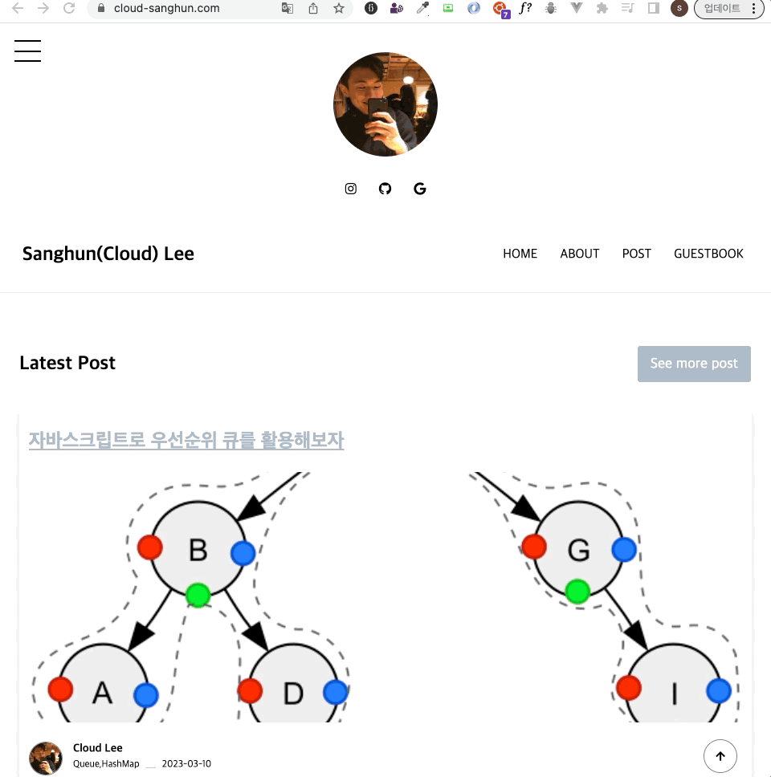
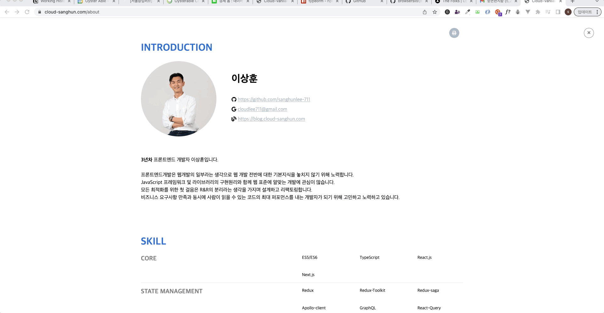

# 링크

[Cloud Sanghun Blog With Vanila JS](https://blog.cloud-sanghun.com/)

# 설명

- Vanilla JS, HTML5, CSS3만을 사용하여 state기반 rerendering, routing을 통한 SPA 개념을 적용하여 개인 블로그를 만들고 있습니다.

- 언젠가는 웹표준인 web components를 적극적으로 활용해 볼 예정입니다.

## SSR 작동방식

- `npm run start` 를 통해 routes폴더 아래에서 api serving과 컨텐츠를 ssr로 페이징 합니다.
- hydration이 아직 진행되어 있지 않은 방식이며 ec2를 별도로 세팅하는 경우 서버에서 npm run build:deploy 후 npm run start를 진행하면 - 4000번 포트에서 제공 됩니다.
- 루트에 있는 api폴더는 추후 vercel에서 호스팅되는 경우 요구사항에 맞추기 위함 입니다.(ec2에서는 별도로 사용 필요가 없습니다.)
- main.yml과 github의 runners를 사용하는 경우 자동배포 설정이 가능합니다.

# UI/UX

## Main page

## Burger Navigation

## Categorized Post

## Infinite Scroll

## Resume with printing

## 개념적 목표

### 2022

- [x] SPA Routing 기능
  - [x] Routing with params
  - [x] Routing without Refresh
- [x] 유기적인 Event Handler 등록
- [x] Component 추상화
- [x] Webpack
  - [x] Build Setting
  - [x] Dev Setting
- [x] Nginx Web server
  - [x] 포트포워딩을 통해 하나의 폴더에 서버와 프론트 띄우기
    - 443 -> api.xxx.com -> 4000
    - 443 -> blog.xxx.com -> dist/index.html
- [x] https setting with AWS load balance, Route 53

### 2023

- [x] Hash Routing -> History Routing for google adsense 👀 and ready for server side
  - [x] apply custom event for a tag and popstate
  - [x] do nginx 404 redirect setting in blog subpath
- [ ] client side -> server side with state manange and component structure
- [ ] state manage -> apply web standards components with shadow dom and use Proxy for managing global state

## UI

### 2022

- [x] 레이아웃
  - [x]GNB
- [x] 포트폴리오 페이지
- [x] 메인 페이지
- [x] 이력서 페이지
- [x] 게시글 페이지

### 2023

- [x] 이력서 페이지 개선
- [x] 게시글 타입 선택박스 UI 개선

## UX

### 2022

- [x] MD파일을 활용한 블로그
  - [x] MD파일 읽어오기
  - [x] CSS해주기
- [x] Pagination
- [x] 카테고리별 글 보기
- [x] 외부 플랫폼을 이용한 댓글
  - [x] Disqus

### 2023

- [ ] FE스러운 재미있는 이벤트가 필요하다.

## Build

### 2022

- [x] FE: Webpack build

### 2023

- [ ] FE: Vite build
