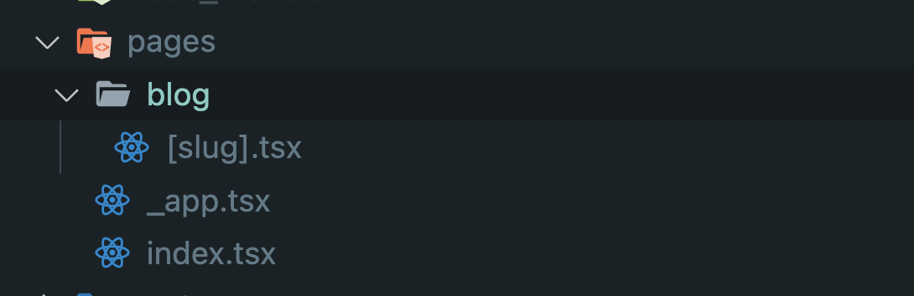
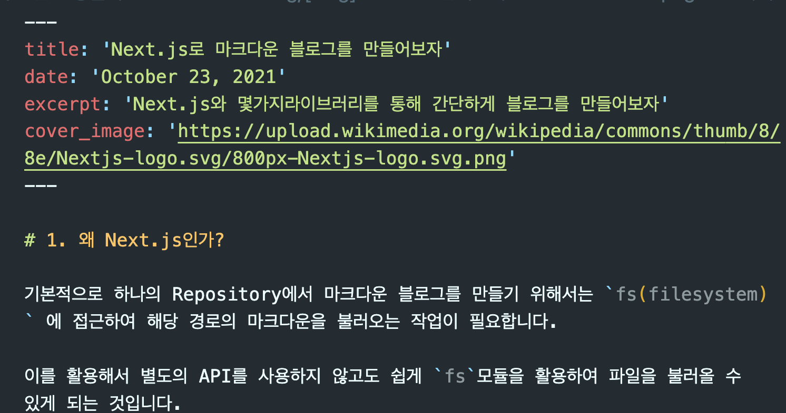
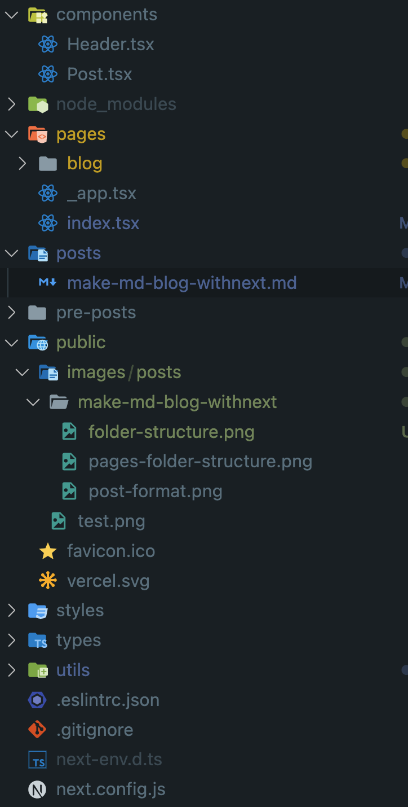

# 1. 왜 Next.js인가?

기본적으로 하나의 Repository에서 마크다운 블로그를 만들기 위해서는 `fs(filesystem)` 에 접근하여 해당 경로의 마크다운을 불러오는 작업이 필요합니다.

이를 활용해서 별도의 API를 사용하지 않고도 쉽게 `fs`모듈을 활용하여 파일을 불러올 수 있게 되는 것입니다.

그럼 `React를 통해서 S3에 간단히 배포해서 사용하면 되지 않을까?` 라는 의문이 들것입니다.

결론부터 말하자면 `fs`는 클라이언트 사이드의 js에서 지원되지 않습니다.

Node.js의 지원 모듈이므로 클라이언트에서 이를 돌릴 수도 없거니와 가능하게 만든다고 하여도 보안의 문제로 인해 브라우저에서 이를 막기 때문입니다.

예를 들어, 나쁜마음을 먹은 개발자가 fs를 클라이언트에서 활용한다고 생각하면 해당 서비스를 사용하는 유저의 컴퓨터의 파일들을 마음껏 해집어 놓을 수 있게 되니까 상식적으로 생각하면 이는 금기시 되는게 당연합니다.

따라서 서버(Node.js)의 자원을 활용하면서 요즘 익숙한 React.js의 개발방식을 활용하기 위해서 Next.js를 선택한 것이라고 보시면 됩니다.

# 2. 그래서 어떻게 만들면 좋을까?

일단 `create-next-app` 커맨드를 활용하여 대부분의 세팅은 지원 받도록 시작합니다.

해당 프로젝트는 yarn 및 TS 템플릿을 사용했습니다.

```md
yarn create next-app 1post1dayblog --typescript
```

그리고 `pages`폴더의 구조를 아래과 같이 잡아줍니다


next js에서의 routing은 `pages` 폴더 아래의 경로에 따라 설정이 됩니다.

현재 사진을 보면 `_app`, `index`를 제외한 blog 라는 경로가 라우터에 존재하고 params를 활용하기 위해 `[slug]`라는 이름으로 하단의 파일이 구성되어 있습니다.

만약 `blog/index.tsx` 라면 우리는 `https://oysterable.com/blog` 의 경로로 밖에 접근할 수 없으나

`blog/[slug].tsx` 를 해줌으로써 `https//oysterable.com/blog/hello` 와 같이 특정 파라미터를 url로 받을 수 있는 컴포넌트를 사용할 수 있게 됩니다.

이를 활용해서 각 `slug`에 맞는 게시물을 불러와서 렌더해줄 것입니다.

## 2.1 `blog/[slug].tsx`를 만들어보자

위 설명에서 이어지듯이 `[slug].tsx` 는 url의 params를 받아와서 매칭 되는 게시물을 받아와 렌더해줄 컴포넌트입니다.

그렇다면 아래와같은 의문이 생깁니다.

#### 1. 어떻게 게시물을 가져오는가?

#### 2. 어떻게 `markdown` 을 변환하는가?

#### 3. 변환된 markdown을 어떻게 렌더하는가?

라이브러리의 도움을 통해 위 질문들을 간단하게 해결할 수 있습니다.

일단 마크다운을 긁어오며 필요한 객체를 만들기 위한[gray-matter](https://www.npmjs.com/package/gray-matter) 와 마크다운 파싱을 위한 [marked](https://www.npmjs.com/package/marked) 라는 라이브러리를 받아보자!

gray-matter에 대한 자세한 설명은 md파일을 만들면서 필요한 `front-matter`라는 컨셉을 설명할 때 추가적으로 이야기 하겠습니다 :)

기능상 마크다운을 가져와서 렌더해주는 것 외에 별도의 변환이 없을 `Static한` 페이지가 생성될 것 이므로 해당 라이브러리가 설치되었다면 아래의 코드를 보면 이해가 편할 것 입니다.

## 2.1.1 어떻게 게시물을 가져오는가?

### Static pages를 위한 경로 만들기

```javascript
import fs from 'fs';
import path from 'path';

export async function getStaticPaths() {
  //fs 라이브러리를 활용해서 루트의 posts폴더에 있는 파일들을 읽어온다.
  const files = fs.readdirSync(path.join('posts'));

  //경로는 각 파일의 이름으로 하기 위해 확장자명만 제거해주고 getStaticPaths 의 리턴 형태에 맞춰 반환해준다.
  const paths = files.map((filename) => ({
    params: {
      slug: filename.replace('.md', ''),
    },
  }));

  return {
    paths,
    //빌드 타임에 생성해놓지 않은 경로로 요청이 들어온 경우 404 반환을 위함.
    fallback: false,
  };
}
```

`getStaticPaths` 를 활용해서 우리가 빌드 할 페이지의 각 경로 별로 Static 렌더링을 위한 페이지를 미리 만들어 지게 합니다.

보여줄 경로가 blog/[slug] 뿐이고 간단히 만들기 위해 fallback옵션을 false로 두고 진행 합니다.

### Static pages를 위해 파일 가져오기

`getStaticProps` 를 통해 경로를 통해 받는 params를 가져올 수 있게 됩니다.

우리는 파일이름을 `[slug].tsx`로 하였으므로 params내부에 slug를 가져오면 됩니다.

위에서 파일 이름을 통한 경로를 활용하기로 하였고 경로를 파일이름으로 받게 되면 해당 파일이름을 사용하여 `fs` 모듈을 활용해 posts폴더 내부에서 해당 md파일을 긁어오면 됩니다.

## 2.1.2 어떻게 `markdown` 을 변환하는가?

그리고 불러온 마크다운 파일을 `gray-matter`라이브러리를 통해 필요한 `data`와 `content`로 만들어주는 객체로 받아오면 됩니다.



자세히 보자면, 사진 상단의 `---` 내부를 `data` 그리고 아래 마크다운으로 작성된 것들을 `content`라는 객체의 이름으로 파싱시켜 줍니다.

여기서 편의를 위해 `data`의 이름은 `frontmatter`로 지정하였습니다.

그래서 url을 통해 받은 slug, 그리고 마크다운 파일을 통해 가져온 frontmatter, content를 컴포넌트로 넘겨주기 위해 리턴합니다.

이렇게 간단하게 마크다운을 불러오고 js에서 사용할 객체로 변환시킬 수 있게 됩니다.

여기서 content의 값은 string으로 모두 가져오게 되는데 이는 컴포넌트 내부에서 `marked`라이브러리를 사용해 변환을 진행하면 됩니다.

```js
import fs from 'fs';
import matter from 'gray-matter';

export async function getStaticProps({ params: { slug } }: { params: string }) {
  const markdownWithMeta = fs.readFileSync(
    path.join('posts', slug + '.md'),
    'utf-8'
  );

  const { data: frontmatter, content } = matter(markdownWithMeta);

  return {
    props: {
      frontmatter,
      slug,
      content,
    },
  };
}
```

## 2.1.3 변환된 `markdown`을 어떻게 렌더하는가?

이미 위의 2.1.1~2를 통해 마크다운을 객체화 시켜 원하는 props를 모두 만들어 놓았으므로
그것을 받아 원하는 형태로 렌더할 컴포넌트를 만들면 됩니다.

markdown 파일 내부에 미리 선정한 frontmatter들과 props로 받을 타입을 미리 선정해주고 활용 합니다.

그리고 div에 marked라이브러리를 통해 파싱된 태그들을 Innerhtml시켜 넣어 줍니다.

```javascript
// 적절한 타입을 미리 선언
interface IFrontMatter {
  title: string;
  author: string;
  excerpt: string;
  categories: string[];
  cover_image: string;
  date: string;
}

interface IPost {
  frontmatter: IFrontMatter;
  slug: string;
}

//getStaticProps를 통해 전달해준 Props를 받아 렌더에 활용
export default function PostPage({
  frontmatter: { title, date, cover_image },
  slug,
  content,
}: {
  frontmatter: IFrontMatter,
  slug: string,
  content: string,
}) {
  return (
    <>
      <Link href="/">
        <a className="btn btn-back">Go Back</a>
      </Link>
      <div className="card card-page">
        <h1 className="post-title">{title}</h1>
        <div className="post-date">Posted on {date}</div>
        
        <div className="post-body">
          //marked 라이브러리를 이용해 html 태그로 변경
          <div dangerouslySetInnerHTML={{ __html: marked(content) }}></div>
        </div>
      </div>
    </>
  );
}
```

이렇게 까지 하면 기능적으로 post폴더 내부에 있는 마크다운을 긁어와서 렌더링을 하는것이 준비 된 것 입니다!

그럼 메인 페이지에서 전체 게시물들을 다 보여주는 것은 어떻게 할 지 다음 순서를 통해서 보도록 하시죠.(사실 조금만 다르지 거의 똑같다.)

페이지의 첫화면을 담당할 `index.tsx`에 위의 기재된 것과 같이 `getStaticProps` 를 활용하여 파일들을 가져와 데이터를 넘겨주면 됩니다.

`Post` 컴포넌트는 frontmatter 와 slug를 받아 각 게시물을 미리보기의 카드형태로 렌더할 용도의 컴포넌트이다.

**빠른 이해를 위해 컴포넌트 및 유틸로 분리된 것을 하나로 적어 놓았습니다.**

```javascript
/* eslint-disable @next/next/no-css-tags */
import fs from 'fs';
import matter from 'gray-matter';
import Head from 'next/head';
import path from 'path';
import { IPost } from '../types';

const sortByDate = (a: IPost, b: IPost): number => {
  return (
    new Date(b.frontmatter.date).getTime() -
    new Date(a.frontmatter.date).getTime()
  );
};

// 타이틀 이미지와 타이틀과 같은 frontmatter를 적절하게 렌더해준다.
function Post({ post }: { post: IPost }) {
  return (
    <div className="card">
      
      <div className="post-date">Posted on {post.frontmatter.date}</div>
      <h3>{post.frontmatter.title}</h3>
      <p>{post.frontmatter.excerpt}</p>
      <Link href={`/blog/${post.slug}`}>
        <a className="btn">Read More</a>
      </Link>
    </div>
  );
}

export default function Home({ posts }: { posts: IPost[] }) {
  return (
    <div>
      <Head>
        <title>Dev Blog</title>
      </Head>
      //받아온 데이터를 회문하며 Post컴포넌트로 넘겨준다.
      <div className="posts">
        {posts.map((post: IPost, index: number) => (
          <Post key={index} post={post} />
        ))}
      </div>
    </div>
  );
}

export async function getStaticProps() {
  //posts폴더 전체를 읽어온다.
  const files = fs.readdirSync(path.join('posts'));
  // 모든 파일들을 회문하며 원하는 형태로 변경한뒤 반환해준다.
  const posts = files.map((filename) => {
    const slug = filename.replace('.md', '');
    const markdownWithMeta = fs.readFileSync(
      path.join('posts', filename),
      'utf-8'
    );

    const { data: frontmatter } = matter(markdownWithMeta);

    return {
      slug,
      frontmatter,
    };
  });
  //별도로 날짜별로 정렬을 시킨 뒤 반환해준다.
  return {
    props: {
      posts: posts.sort(sortByDate),
    },
  };
}
```

# 여기서 무엇을 더 할 수 있을까?

이렇게 하면 필요한 기능은 모두 완료가 된 상태입니다.

아래 폴더구조와 같은 상태가 되어있다면 markdown 데이터들을 불러와 `Next.js` 앱에 별도의 서버 세팅없이 원하는 형태로 블로그를 커스터마이징 할 수 있을 것 입니다.



추가로 더 하면 좋을 것은 [`highlight.js`](https://www.npmjs.com/package/highlight.js) 와 같은 하이라이팅 라이브러리를 활용해서 코드부분을 조금 더 이쁘게 보여주는 것이 있습니다.

또, vercel 및 github을 잘 활용하여 CI/CD를 구축해 편안한 블로깅을 할 수 있게도 만들 수 있을 것 입니다.

# 참고

- [Static Blog With Next.js and Markdown-Traversy Media](https://youtu.be/MrjeefD8sac)
- [NPM-marked](https://www.npmjs.com/package/marked)
- [NPM-gray-matter](https://www.npmjs.com/package/gray-matter)
