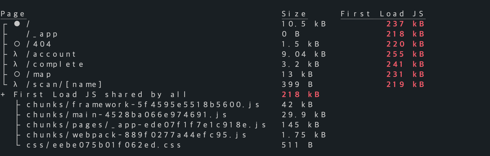
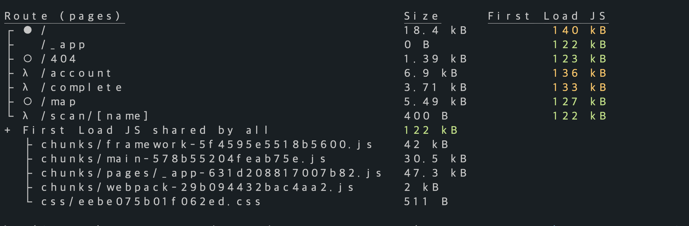
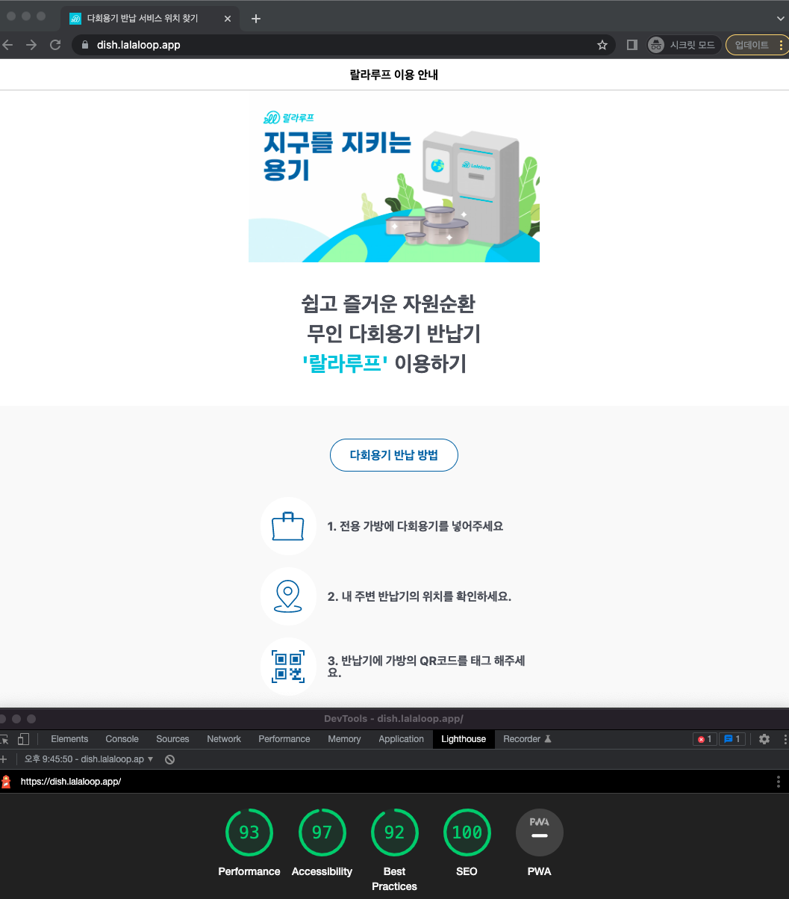

# 라이트 하우스란?

[구글 크롬](https://chrome.google.com/webstore/detail/lighthouse/blipmdconlkpinefehnmjammfjpmpbjk)에서 지원해주는 익스텐션으로 설치 후 특정 도메인의 최적화 점수를 평가 받을 수 있는 툴입니다.

## 진행하게 된 이유

현 회사에서 처음으로 외부에 노출되는 도메인의 프론트를 직접 담당하게 되었습니다.

그래서 가능한 부분을 최적화 시켜 UX를 최대한 개선시켜보고자 lightHouse의 힘을 빌렸습니다.

# 최적화 단계

최적화 진행을 단계별로 확인해보고 코드의 변경에 맞춰 변경된 것들을 살펴보면 좋을 것 같아서 아래와 같은 순으로 글을 진행해보려 한다.

## 1. 개발이 완료된 상태에서의 빌드용량



우선 프로젝트의 규모에 비해 말도안되게 사이즈가 크게 번들링 되는것에 있어서 의문이 생겼다.

현재 프로젝트에서 테스트를 위해 `msw`라는 라이브러리를 통해 테스트를 진행하는 경우 mockServiceWorker를 돌리는 로직이다.

일단 msw를 불러오는 util의 내용을 보자

```javascript
import { rest } from 'msw'; //얘가 289.9k(gzipped:81.1k);

const initMockAPI = async () => {
  if (typeof window === 'undefined') {
    const { server } = await import('./server');

    server.listen();
  } else {
    const { worker } = await import('./browser');

    worker.start();
    window.msw = {
      worker,
      rest,
    };
  }
};

export default initMockAPI;
```

`_app.tsx`에서 아래와 같은 코드가 있었다.

```javascript
import initMockAPI from 'mock/index';

if (process.env.NEXT_PUBLIC_MSW_ENABLE === 'enabled') {
  initMockAPI();
}
```

위 코드에서 보이듯 미리 `initMockAPI` import를 시켜놓은 것이 번들링 용량의 기본용량을 차지하면서 base JS의 용량이 높아진것이었다.

그래서 아래와 같이 조건이 맞는 경우에만 import를 시켜서 사용하는 방법으로 변경을 하여 상용 배포시에는 용량을 줄일 수 있게 되었다.

```javascript
if (process.env.NEXT_PUBLIC_MSW_ENABLE === 'enabled') {
  (async () => {
    const dynamicMockAPI = await import('mock/index');
    await dynamicMockAPI.default();
  })();
}
```



## 2. 퍼포먼스 개선하기

라이트하우스의 퍼포먼스에는 아래와 같은 지표가 있다

- **FCP(First Contentful Paint)**
  `초기 DOM 컨텐츠를 렌더링하는데 걸리는시간을 측정하나 가장 큰 컨텐츠를 렌더링하는 시간(LCP)은 제외하고 측정한다.`
- **TBT(Total Blocking Times)**
  `FCP와 TTI(Time To Interactive) 사이의 시간이다, 그러니까 렌더링되고 나서 상호작용이 가능한 상태가 될때까지 걸리는 시간을 의미하며 200ms언더가 이상적이다.`
- **LCP(Largest Contentful Paint)**
  `가장 큰 컨텐츠를 렌더링 하는 시간이다.`
- **CLS(Cumulative Layout Shift)**
  `사용자가 예상하지 못한 레이아웃 변경을 경험하는 빈도를 정량화 하는 것이다 다른말로 시각적 안정성을 측정하는 지표인데 낮을수록 페이지가 만족스러워 진다고 한다. 예를들면 특정 버튼을 눌렀을때 갑자기 버튼이 상단에서 나타나 전체 레이아웃의 위치가 변경되거나와 같은 작업에 대한 정량화이다.`

여기서 LightHouse가 평가를 진행한 프로젝트에 대해 좋지않게 평가한 부분은 **FCP**, **LCP** 두가지 항목이 해당되었다.

## 3. FCP 개선하기

FCP로 문제재기가 되었던 것은 폰트를 link를 통해 불러오는 과정에서 요청 후 응답을 받아오는 시간에 이미 렌더링이 진행되고 있는 와중에

폰트가 불러와짐에 따라 다시 렌더링이 진행되며 렌더링 블락에 걸리는 것이 문제가 되었다.

기존의 `_app.tsx`에는 아래와 같이 링크태그를 통해 폰트를 불러왔다.

```html
<link
  href="//spoqa.github.io/spoqa-han-sans/css/SpoqaHanSansNeo.css"
  rel="stylesheet"
  type="text/css"
/>
```

외부 요소의 링크를 미리 읽어오기 위해서 link 태그의 `preconnect` 설정을 통해 폰트와 관련된 것을 불러오도록 설정하였다.

`preconnect`를 사용하면 브라우저가 사이트에 필요한 연결을 미리 예상할 수 있게 되므로 브라우저는 필요한 소켓을 미리 설정할 수 있기 때문에 DNS(Domain Network Server), TCP(or UDP), TLS(TransportLayer Security Protocol) 왕복에 필요한 시간을 절약할 수 있게 된다고 한다.

```html
<link
  href="//spoqa.github.io/spoqa-han-sans/css/SpoqaHanSansNeo.css"
  rel="preconnect stylesheet"
  type="text/css"
/>
/>
```

## 3. LCP 개선하기

해당 프로젝트는 메인페이지 제일 상단에 배너 이미지가 하나 들어가게 된다.

이 이미지를 디자인팀에서 수령할 때 부터 모바일에 맞춰진 것이라 별도의 높이 너비 설정 없이 사용하고 있었다.

그리고 프로젝트가 Next.js기반이지만 간헐적으로 이미지 퀄리티가 떨어지는 현상을 발견하여 html의 기본 이미지 태그로 대체하여 사용하고 있었다.

그리고 레이지로딩을 걸어 초반 렌더링을 조금이라도 빨리진행하려고 하였다.

```html

```

여기서 간과한점은 가장 큰 컨텐츠를 이미지의 크기가 정해져있지 않은 상태에서 레이지 로딩을 하게 되면 로딩이 완료된 후 다시 리페인팅 작업을 브라우저에서 실행해야하므로

의도치 않은 렌더링비용이 발생하는 것이다.

그래서 아래와 같이 `next/image`를 통해 최적화를 진행해주었다.

```javascript
<Image
  src="..."
  alt="메인배너"
  width={390}
  height={230}
  quality={100}
  priority
  placeholder="blur"
/>
```

우선순위를 높여 가장 빨리 로드를 시킨다음 컨텐츠를 그리도록 옵션을 주었고 next/image는 widht/height가 정해져있어도

layout을 따로 정하지 않으면 어느정도 수준의 반응형과 최적화를 진행해주어 한결 편한 최적화가 가능했다.

그리고 기본 퀄리티가 75로 세팅되어있기 때문에 100으로 퀄리티를 올려주며 최적화를 완료했다.

# 결론

최적화를 진행하면서 다시한번 렌더링 전체 프로세스에 대해 생각해보게 되었고 그 와중에 좋은 컨셉들과 각 태그들의 좋은 옵션을 많이 알게되어 유익한 시간이 되었다.

그리고 글에 거창하게 적혀있어 보이지만 대부분의 개선이 가능한 사항은 LightHouse가 조언을 해주므로 그 말만 잘 따라하면 점수 개선이 아주 쉽게 되는것이 좋았다.

여기에서 다루지는 않았으나 SEO과정에서 Next.js의 편리함을 다시한번 느끼게 되었다.

비록 TTI가 4.8씩이나 찍혀 안타깝긴 하지만 90점대를 넘은것에 의의를 두며 끝마쳐본다.



# 참고

- [What will be the best way to load CSS async?-StackOverFlow](https://stackoverflow.com/questions/41876608/what-will-be-the-best-way-to-load-css-async)
- [MDN-Link types:preload](https://developer.mozilla.org/en-US/docs/Web/HTML/Link_types/preload)
- [MDN-CSS performance optimization](https://developer.mozilla.org/en-US/docs/Learn/Performance/CSS)
