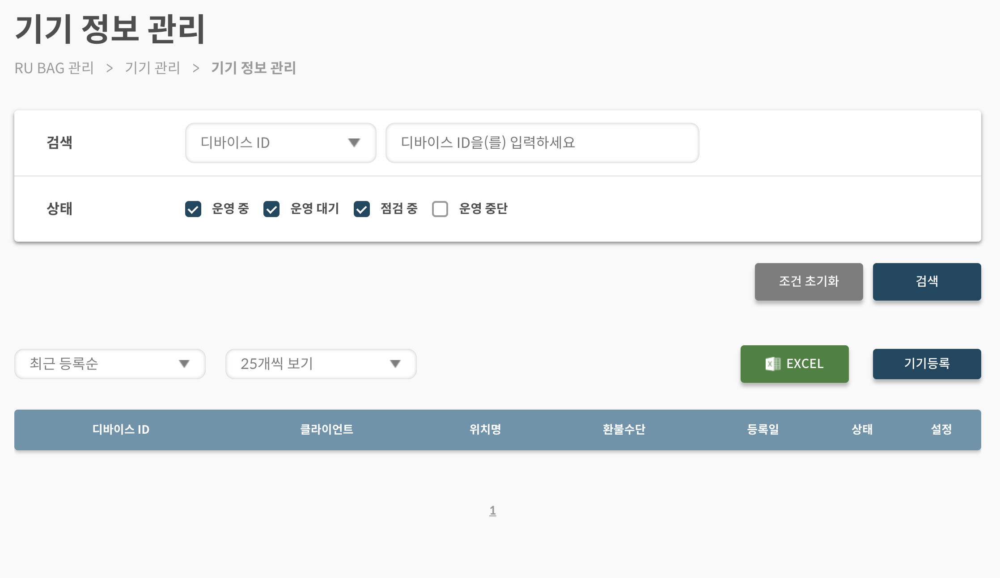
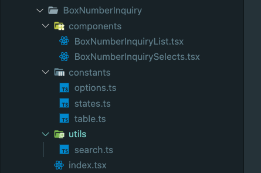
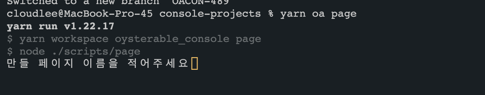
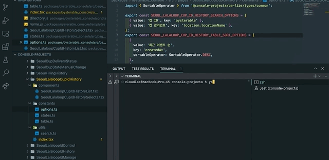

# 시작하게 된 이유

현재 회사에서 작업하고 있는 백오피스(회사내에서는 콘솔이라 불리우는 시스템)를 작업한지 어언 1년정도가 되어가고 있는 시점이다.

초기 구조를 잡고 세팅을 한건 본인이었으나 도중에 다른 개발자분에게 위임을 하였었고.. 담당하신분이 퇴사를 하게 되시면서 6~7개월 만에 다시 핸들링하게 되었다.

팀 내적으로 인원변화도 생기고 프로젝트도 추가적으로 늘어나고 있는 상황이라 반복작업을 어떻게든 줄여서 업무시간을 확보하는 것이 필요하다고 판단했다.

그리고 어느 유튜브에서 본 글귀가 생각났다.

`개발자면 3~5번이상 반복되는 작업은 간단한 스크립트화 시켜서 업무효율을 올릴 수 있어야한다고ㅎㅎ..`

그래서 이미 여러 도메인을 가진 유사한 프로젝트가 산재되어있는 백오피스 프로젝트들을 모노레포화 하는 작업은 진행을 하였었고, UI라이브러리도 해당 모노레포로 옮겨 놓은 상태였기에 간단한 CMD명령어로 하나의 페이지를 생산하는 코드와 구조를 만드는것이 가능할 것이라 생각이 되었다.

물론 기존에 존재하는 `route.ts` 와 같은 파일 내부에 바로 코드를 주입하는 등의 행위는 진행을 못하였다.

경로문제 및 prefix문제 등..고려할 지점이 많아졌기에 새로 생성되는 폴더 및 파일만 스크립트로 작성해보는 것으로 진행했다.

# 1. 구성요소

일단 백오피스페이지의 전반적인 UI가 대부분 일관적이다.



상단의 검색박스 + 하단의 테이블 + 기타 모달 및 테이블 위에 추가적인 버튼들 등..
으로 기본적으로 상단의 검색박스와 하단의 테이블은 수정페이지나 특정 페이지 외에는 거의 모든 페이지에 들어가는 상태였고, 이 작업을 담당하던 개발자분들은 모두 복사붙여넣기로 진행한 뒤 페이지 이름에 맞는 컴포넌트로 다시 이름만 변경하는 작업을 통해 진행하였다.

그래서 상단의 검색박스 + 하단의 테이블까지는 커맨드라인을 통해서 만들 수 있도록 진행해보자라고 결론이 났고 여기에 필요한 파일들을 추렸다.



위 사진과 같이 하나의 페이지 내에 `components`, `utils`, `constants` 폴더가 들어가고 그 하단에 각 필요한 컴포넌트 및 파일이 들어가는 형태이다.

그럼 이런 구조의 폴더를 어떻게 자동으로 만들 수 있을까?

우선 생각을 통해 정리된 요구사항을 하나하나 짚어보자.

1. 폴더구조가 `src/pages/페이지이름` 형태로 우선 만들어 져야한다.

2. `src/pages/페이지이름` 아래에 `components`, `utils`, `constants` 폴더들 및 index.tsx 파일까지 생성되어야한다.

3. 각 파일 내부에 내가 원하는 코드를 작성해야한다.

4. 변수 이름을 prefix(페이지이름)를 접목하여 네이밍 컨벤션에 맞게 만들어야 한다.

위 요구사항을 진행하기 이전에 어떻게 커맨드를 돌아가게 만들지 정해야했는데 `package.json`에 그냥 명령어를 입력하도록 만들기로 했다.

# 2. 스크립트를 Node.js를 활용해서 짜보자

우선 Node.js의 `fs` 모듈을 적극적으로 활용하려 했다. 이름 그대로 파일시스템이기 때문에 원하는 대부분의 기능이 있을것이라 판단이 되었고 정말 다 있었다.

이렇게 진행한 이유는 가장 익숙하기도 하고 다른 프론트 개발자 팀원 분들의 접근도 가장 용이할 것이라 판단했기 때문이다.

package.json내에 아래와 같은 scripts를 추가해주고 경로에 맞게 프로젝트 루트에 scripts폴더와 page.js를 만들어주었다.

```
    "page": "node ./scripts/page"
```

page.js내에는 CMD창에 원하는 값을 입력하기 위해 `readline` 모듈을 가져온 뒤 `createInterface` 메서드를 활용했다.

아래 코드를 봐보자.

```javascript
//directory관련된 코드 작성을 위해 분리한 js파일
const directory = require('./directory.js');

//readline 모듈을 통해 아래 블록의 코드처럼 필요한 값을 cmd에 입력된 값으로부터 가져올 수 있게 된다.
const readline = require('readline').createInterface({
  input: process.stdin,
  output: process.stdout,
});

readline.question(`만들 페이지 이름을 적어주세요`, (name) => {
  directory.scaffoldPage(name);
  readline.close(); //종료
});
```

그럼 아래 페이지와 같이 터미널에서 원하는 질문을 남기고 값을 받아오는 UX(DX)가 가능해진다!



# 3. 폴더구조를 만들어보자.

이제 입력받은 이름을 통해 폴더를 원하는 위치에 만들어보자.

```javascript
const fs = require('fs');
const { promisify } = require('util');

const createDirectory = (dirPath) => {
  return promisify(fs.mkdir)(dirPath);
};
```

위와 같이 fs모듈을 이용해 폴더를 만들기 위한 `mkdir` 메서드를 사용하고, 이 때 진행되는 비동기처리를 좀 더 용이하게 하기 위해 util모듈의 `promisify` 메서드를 활용했다.

또 경로를 쉽게 가져오기 위해 아래와 같이 기본 경로를 변수로 잡아주었다.

```javascript
const scriptsRegEx = /scripts/i;
const pagesDirPath = `${__dirname.replace(scriptsRegEx, 'src')}/pages`;
```

src내부에 pages폴더 내부에 원하는 페이지들이 들어있는 구조이므로 기존의 룰을 따라 경로를 잡고 비동기의 체이닝을 활용해 원하는 경로에 원하는 폴더 그 아래에 파일 그 내부에 코드 작성의 순서로 코드가 진행되도록 작성되었다.

아래코드를 살펴보자.

```javascript
createDirectory(path.join(pagesDirPath, projectName))
  .then(() => {
    //promise타입의 파일을 계속 리턴해주며 dot chaining을 활용해서 작성진행.
    return createDirectory(path.join(pagesDirPath, projectName, 'components'));
  })
  .then(() => {
    //경로를 변수로 할당하여 조금 더 가독성을 높여보려 함. components폴더가 들어갈 경로.
    const componentFolderPath = path.join(
      pagesDirPath,
      projectName,
      'components'
    );
    //components폴더 내부에 페이지이름+Selects 컴포넌트 이름의 컴포넌트파일이 생성될 경로
    const selectsComponentPath = path.join(
      componentFolderPath,
      `${selectsComponentName}.tsx`
    );

    //아직 언급하지 않은 createFile메서드를 통해 필요한 파일 생성.
    return createFile(
      selectsComponentPath,
      selectsComponent.createSelectsComponent(projectName)
    );
  });
```

코드 내부 주석에서 확인할 수 있듯이 생각보다 간단하게 계속 체이닝을 걸어 제일 상단의 Depth에서 하단의 Depth로 내려가도록 작성을 진행해주었다.

# 4. 각 파일 내부에 내가 원하는 코드를 작성해보자!

이제 위 `3. 폴더구조를 만들어보자.` 에서 언급을 하지 않았다고 이야기했던 `createFile`에 대해 이야기 해볼 시간이다.

이쪽도 `createDirectory` 라는 메서드와 거의 유사하게 진행되는데.. 한가지 다른점은 폴더는 내부 내용이 없으나 파일은 내부에 들어가는 컨텐츠가 필요하다는 점이다.

따라서 아래코드와 같이 content라는것을 넣어주어야하고 `utf-8`로 기본 인코딩옵션을 잡아주었다.

```javascript
const createFile = (filePath, content) => {
  return promisify(fs.writeFile)(filePath, content, 'utf-8');
};
```

그래서 위에서 언급되었던 코드의 일부를 가져와보면 아래와 같은데. 여기서 createFile에 들어갈 content에 관한 내용은 string타입으로 기재해주면 된다. 유지보수의 편의를 위해 해당코드에서는 다른 파일로 분리해놓은 상태이다.

```javascript
...

const componentFolderPath = path.join(pagesDirPath, projectName, 'components');
//components폴더 내부에 페이지이름+Selects 컴포넌트 이름의 컴포넌트파일이 생성될 경로
const selectsComponentPath = path.join(
  componentFolderPath,
  `${selectsComponentName}.tsx`
);

return createFile(
  selectsComponentPath,
  selectsComponent.createSelectsComponent(projectName) //`${selectsComponentName}.tsx` 파일안에 들어갈 내용에 해당하는 것.
);

...
```

참고로 `createSelectsComponent`메서드 코드의 일부를 공유하면 `template string`에 원하는 prefix가 붙는형태로 코드 만들 수 있게하여 string을 return하는 형태이다.

```javascript
const createSelectsComponent = (pageName) => {
  const { inputState, selectState, searchOptionsName, selectsComponentName } =
    makeNameFormat(pageName);

  return `
  import React from 'react';
  ...일부 생략
  import { ${searchOptionsName} } from '../constants/options';
  import {
    ${inputState},
    ${selectState},
  } from '../constants/states';
  ...일부 생략
  interface I${selectsComponentName}Props {
    searchType: TSelectOption;
    searchValue: string;
    period: TSelectOption;
    handleInput: THandleInput<typeof ${inputState}>;
    handleSelect: THandleSelect<typeof ${selectState}>;
  }

  const ${selectsComponentName}: React.FC<
    I${selectsComponentName}Props
  > = ({
    searchValue,
    searchType,
    handleInput,
    handleSelect,
    period,
  }) => {
    return (
      <BasicSelectorContainer>
        <PageSelectWrapper>
          <PeriodAndRadioContainer>
            <RadioButtons
              radioOptionsList={PERIOD_DATE_OPTIONS}
              selectRadioValue={period}
              handleRadioValue={handleSelect}
              name="period"
              label="기간 선택"
            />
          ...일부 생략
          </WrapperDefault>
        </PageSelectWrapper>
      </BasicSelectorContainer>
    );
  };

  export default ${selectsComponentName};
  `;
};
```

자 이제 폴더 내에 파일을 만들었고 파일내에 원하는 내용도 작성할 수 있게 되었다.

이제 원하는 prefix를 붙여서 네이밍컨벤션을 지킬 일만 남았다!

# 5. 변수 이름을 prefix(페이지이름)를 접목하여 네이밍 컨벤션에 맞게 만들어보자

코드를 그래도 훑어보신분들은 `makeNameFormat` 이라는 함수를 기억하실텐데 이 함수가 필요한 포맷에 맞춰 이름을 만들어주는 역할로 작성하였습니다.

크게 prefix포맷팅을 할때 두가지 케이스가 필요했는데 상태를 나타낼때 사용할 카멜케이스와 스크림 스네이크 케이스 두가지가 필요하였고 아래와 같은 함수로 작성했다.

일단 기본적으로 pageName으로 들어오는 인자 자체가 PascalCase(파스칼표기법)이라는 전제하에 작성된 것이다.

에러처리가 조금 더 들어가면 좋겠지만 내부적으로 협의가 되어있으므로 일단은 이렇게 진행했다.

```javascript
const makeCamelNameFormat = (pageName) => {
  //제일 첫글자 Lower로 변경
  return pageName
    .split('')
    .map((word, index) => {
      if (index === 0) return word.toLowerCase();
      if (word.toUpperCase() === word) return word;
      return word;
    })
    .join('');
};

const makeScreamSnakeFormat = (pageName) => {
  //필요부분에 언더바와 upper변경
  return pageName
    .split('')
    .map((word, index) => {
      if (index === 0) return word.toUpperCase();
      if (word.toLowerCase() === word) return word.toUpperCase();
      if (word.toUpperCase() === word) {
        return `_${word.toUpperCase()}`;
      }
    })
    .join('');
};
```

그리고 Node.js를 통한 개발이므로 개발 편의를 위해 CJS를 통해 모듈을 반환하고 있는 중이기에, 모듈 반환시 아래와 같이 작성하여 미리 이름을 다 만들어주게 하였다.

```javascript
module.exports = (pageName) => {
  const stateName = makeStatesNameFormat(pageName);
  const upperSnakeName = makeUpperSnakeFormat(pageName);

  return {
    inputState: `${stateName}InputStates`,
    selectState: `${stateName}SelectStates`,
    listComponentName: `${pageName}List`,
    selectsComponentName: `${pageName}Selects`,
    indexComponentName: `${pageName}`,
    getSearchableUtilName: `get${pageName}SearchValue`,
    searchOptionsName: `${upperSnakeName}_SEARCH_OPTIONS`,
    tableSortOptionName: `${upperSnakeName}_TABLE_SORT_OPTIONS`,
    tableHeadNames: `${upperSnakeName}_LIST_HEAD_NAMES`,
  };
};
```

이렇게 실제로 네이밍이 페이지이름에 따라 변경되는 케이스에 대한 이름을 모두 만들어놓았고 createFile에서 코드를 넣을 때 또는 파일 생성시 들어가는 이름에 이를 활용하였다.

# 끝



이렇게 Node.js를 이용하여 반복되는 백오피스 작업의 일부분을 자동화하였다.

동료 개발자분의 평도 굉장히 좋았기에 최근들어 개발을하며 조금이나마 재미있게 진행한 프로젝트인것 같다!

아래는 이해의 편의를 돕기위해 `scaffoldPage` 메서드를 통해 일부 코드를 그대로 옮겨서 공유 해보려한다. 회사 내부 코드 상 중요한부분인 컨텐츠 기입과 같은 부분은 실제로 나타나지 않으므로 참고가 필요하다.

## 코드 일부 공유

```javascript
const fs = require('fs');
const path = require('path');
const indexPage = require('../templates/indexPage.js');
const listComponent = require('../templates/components/list.js');
const selectsComponent = require('../templates/components/selects.js');
const optionConstant = require('../templates/constants/options.js');
const statesConstant = require('../templates/constants/states.js');
const tableConstant = require('../templates/constants/table.js');
const searchableUtil = require('../templates/utils/search.js');
const nameFormat = require('../templates/name.js');
const { promisify } = require('util');

const scriptsRegEx = /scripts/i;
const pagesDirPath = `${__dirname.replace(scriptsRegEx, 'src')}/pages`;

const createDirectory = (dirPath) => {
  return promisify(fs.mkdir)(dirPath);
};

const createFile = (filePath, content) => {
  return promisify(fs.writeFile)(filePath, content, 'utf-8');
};

// * TODO: 여기도 반복작업이라.. 조금 더 수정하면 깔끔해질 수 있을 것 같다는 생각이 듦.
function scaffoldPage(projectName) {
  const { listComponentName, selectsComponentName } = nameFormat(projectName);

  createDirectory(path.join(pagesDirPath, projectName))
    .then(() => {
      return createDirectory(
        path.join(pagesDirPath, projectName, 'components')
      );
    })
    .then(() => {
      const componentFolderPath = path.join(
        pagesDirPath,
        projectName,
        'components'
      );
      const selectsComponentPath = path.join(
        componentFolderPath,
        `${selectsComponentName}.tsx`
      );
      return createFile(
        selectsComponentPath,
        selectsComponent.createSelectsComponent(projectName)
      );
    })
    .then(() => {
      const componentFolderPath = path.join(
        pagesDirPath,
        projectName,
        'components'
      );
      const ListComponentPath = path.join(
        componentFolderPath,
        `${listComponentName}.tsx`
      );
      return createFile(
        ListComponentPath,
        listComponent.createListComponent(projectName)
      );
    })
    .then(() => {
      return createDirectory(path.join(pagesDirPath, projectName, 'utils'));
    })
    .then(() => {
      const utilsFolderPath = path.join(pagesDirPath, projectName, 'utils');
      const searchFilePath = path.join(utilsFolderPath, `search.ts`);

      return createFile(
        searchFilePath,
        searchableUtil.createSearchableUtils(projectName)
      );
    })
    .then(() => {
      return createDirectory(path.join(pagesDirPath, projectName, 'constants'));
    })
    .then(() => {
      const constantsFolder = path.join(pagesDirPath, projectName, 'constants');
      const statesFilePath = path.join(constantsFolder, `states.ts`);

      return createFile(
        statesFilePath,
        statesConstant.createStatesConstants(projectName)
      );
    })
    .then(() => {
      const constantsFolder = path.join(pagesDirPath, projectName, 'constants');
      const optionsFilePath = path.join(constantsFolder, `options.ts`);

      return createFile(
        optionsFilePath,
        optionConstant.createOptionsConstants(projectName)
      );
    })
    .then(() => {
      const constantsFolder = path.join(pagesDirPath, projectName, 'constants');
      const tableFilePath = path.join(constantsFolder, `table.ts`);

      return createFile(
        tableFilePath,
        tableConstant.createTableConstants(projectName)
      );
    })
    .then(() => {
      const indexPath = path.join(pagesDirPath, projectName, 'index.tsx');

      return createFile(
        indexPath,
        indexPage.createIndexFileInPage(projectName)
      );
    })
    .then(() => {
      console.log(
        `페이지 ${projectName}가 성공적으로 해당 경로에 생성 되었습니다. ${path.join(
          pagesDirPath,
          projectName
        )}`
      );
    })
    .catch((error) => {
      console.log(error);
    });
}

module.exports = {
  scaffoldPage,
};
```

## 참고

- [StackOverFlow-Create multiple folders with files inside](https://stackoverflow.com/questions/47686948/create-multiple-folders-with-files-inside)
- [Node.js-fs](https://nodejs.org/api/fs.html)
