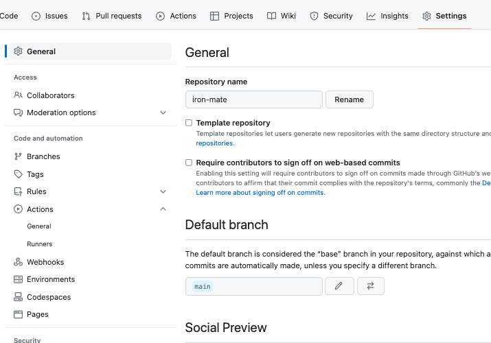
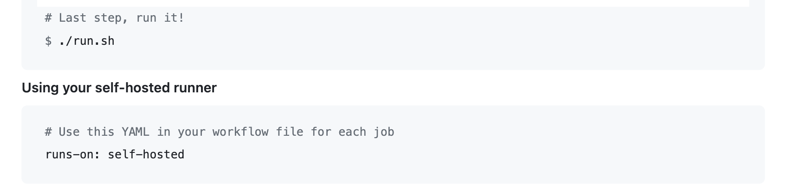

# 시작하게 된 이유

바닐라 자바스크립트 공부를 한다는 핑계로 블로그를 직접 만들어 사용한지 어언 1년이 넘어가는 시점이었다.

언젠가 자동배포 적용을 해야지!라고 생각정도는 하고 있었으나, 터미널에서 들어가서 업데이트하는게 개인적으로 그렇게 귀찮은 작업으로 받아들여지지 않아서 필요를 체감하지 못했던 것 같다.

그래도 블로그 내에 글을 계속 쓰려다보니 업데이트를 하는 것에 귀찮음이 느껴져 제대로 한번 진행해보려고 **Github Actions**를 활용해보기로 했다.

내 [블로그 레포지토리](https://github.com/sanghunlee-711/Cloud-Vanilla-Blog)는 공개 레포인지라 actions가 무료이다.

그래서 어떤방식으로 이것을 진행하면 좋을까 생각해보았을 때 내가 터미널을 통해 해당 서버에서 작성하는 커맨드를 우선 정리하였다.

# 1. 행위 정리

```md
1. .pem파일을 통해 ssh로 해당 ec2 인스턴스에 접속한다
2. root폴더에서 `cd /home/ubuntu/Cloud-Vanilla-Blog/`로 해당폴더로 이동
3. `git pull origin main` git으로 업데이트된 코드 가져오기
4. `npm i` 패키지 업데이트
5. `pm2 kill` pm2 잠시 멈춤(api)
6. `npm run build:deploy` 배포 빌드
7. `pm2 start npm -- run start` pm2 다시 시작
```

으로 행위가 정리되었다. 이제 이것을 어떻게 자동으로 실현시키나가 관건이 되었다.

검색을 해본결과 특정 `uses` 를 설정해주면 오픈소스에서 제공해주는 라이브러리가 알아서 다 해주고.. 위에 정리된 스크립트만 순서대로 나열하면 될 것 같았다.

# 2. 시도

일단 workflow사용을 위해서는 yml파일을 루트폴더내에 `.github`폴더에 넣어줘야한다.

아래 사진과 같이 파일을 만들어주면 된다.


여기저기 검색을 통해 오픈소스를 사용하는 ssh 연결방법이 있기에 그 포스트를 기반으로 커맨드를 짜려고 아래와 같이 작성해보았다.

```yml
# main.yml
name: main branch auto ci process script

on: # 아래 job을 실행시킬 상황
  push:
    branches: [main] # main브랜치 푸쉬 받으면 작동

jobs: # 작동할 일
  deploy:
    name: deploy #github 아이콘에 나타날 과정 이름
    runs-on: ubuntu-latest # 실행될 인스턴스 OS와 버전

    steps:
      - name: excuting remote ssh commands # 각 단계 이름
        uses: appleboy/ssh-action@v0.1.6 # ssh 접속하는 오픈소스
        with:
          host: ${{ secrets.REMOTE_IP }} # 인스턴스 IP
          username: ${{ secrets.REMOTE_ID }} # 우분투 아이디 난 ubuntu임
          key: ${{ secrets.REMOTE_PEM }} # ec2 pem key
          port: ${{ secrets.REMOTE_SSH_PORT }} # 접속포트
          script: | # 실행할 스크립트
            cd /home/ubuntu/Cloud-Vanilla-Blog/
            git pull origin main
            npm i
            pm2 kill
            npm run build:deploy
            pm2 start npm -- run start
```

그리고 github에 secrets.XXX 와 관련된 값들을 넣어주었고, username과 port가 의미하는 것이 헷갈렸으나 username은 ubuntu, port는 22로 ssh를 통해 접속하는 커맨드 `ssh -i xxx.pem ubuntu@xx.xxx.xxx.xxx`에 이름에 대한 정답이있었다.

그리고 보통 ssh 접속은 22포트로 진행되므로 이를 그대로 사용하면 되었다.

_그런데 막상 해당 커맨드를 적용하여 시도를 해보니 timeout에러가 발생하였다_

따라서, 유사 에러코드를 검색해서 깃헙이슈를 확인해보았고, 버전문제라는 이슈 덕분에 재빠르게 버전만 변경해서 진행해보았다.(0.1.6 —> 0.1.9)

아쉽게도 해당 문제는 해결되지 않았고, issue를 또 찾아보니 `너가 secrets를 잘못 넣어서 그런걸 수도 있어!` 라고 하여 다시 값들을 재 설정해보았다.

그럼에도 원하는 방식으로 작동이 되지 않았고.. 이제 생각이라는 것을 해보기로 하였다.

여기서 보안 문제일 수도 있겠다는 힌트를 얻게 되었다.

- secrets가 잘못되어서 timeout이 난거라면
- ssh로 의 접속이 문제가 되는 것인데 그렇다면 보안그룹이 문제일 수도 있을 것 같다
- **그런데 심지어 나는 특정 IP외에는 ssh 접속에 사용되는 포트인 22를 ec2에서 열어주지도 않는다**
- 깃헙에서 아무렇게나 접근하는 것이 가능할까?
- AWS가 github전체를 열어주는 말도안되는 유동성을 가졌다면 가능할지도?..

# 3. 시련

EC2에 보안그룹으로 inbound룰은 필수라 생각하기에 설정을 해놓았고 이 룰로 timeout에러가 나는것으로 개인적으로 확정을 하였다.

따라서, 검색을 통해 찾았던 해당 라이브러리를 사용하여 작성된 스크립트나 설명 글들은 아마도 **터미널 inbound룰이 없는 상태**의 것인 것으로 유추했다.

그럼 이 작업하나를 위해 보안그룹을 풀수도 없고, 그렇다고 계속 동일한 IP주소로 github에서 해당 인스턴스로 접근해주는 것이 아니기에 보안그룹의 룰만을 변경한다고 해결되는 일은 아닌 것이라 생각되었다.

그래서 또 열심히 해결 방법 디깅을 시작하였다.

어째저째, [`Self-hosted runner`](https://docs.github.com/en/actions/hosting-your-own-runners) 라는 키워드를 알게 되었다.

## Self Hosted Runner

간단히 개념만 말하면, workflow를 Github 에서 제공하는 가상머신이 아니라, 우리가 직접 지정한 환경에서 실행할 수 있다는 뜻이다.

즉, 우리의 ec2 인스턴스에서 특정 이벤트(트리거)가 발생할 때 마다 workflow를 직접 실행할 수 있다.

```md
사용자는 자체 서버, 가상 머신 또는 물리적 머신에 self-hosted runner를 등록하고,
GitHub Actions에서 작업을 실행할 때 해당 runner를 대상으로 지정할 수 있습니다.
이렇게 하면 소스 코드와 작업 데이터가 사용자가 소유한 환경에서 안전하게 유지될 수 있으며,
실행 시간과 자원에 대한 더 많은 제어권을 가질 수 있습니다.
```

EC2내에 Runner를 설치하기 위해 스크립트를 받아와야 하는데, 해당 레포지토리의 **Settings > Actions > Runners > New self-hosted runner**를 클릭하면



아래와 같은 Download 타이틀 아래 스크립트가 뜨게 된다.

나의 인스턴스는 리눅스이기에 세팅에 맞춰 아래 스크립트를 해당 인스턴스에 접속하여 복사 붙여넣기 해주면 알아서 설치가 완료된다.


스크립트는 `.sh파일`로 일반적으로 실행을하면 터미널에 접속을 끊는경우 실행이 멈추기에 `nohup` 이라는 명령어를 추가 조합하여 세션이 끊겨도 계속 지속실행을 시켜주어야 한다.

나의 경우는 main브랜치에 푸쉬하는 경우 actions를 돌리고 싶었기에 더더욱 필요하였다.

따라서, `nohub ./run.sh &` 으로 실행을 시켜주었다.



그렇게 참고하여 ec2 인스턴스에 러너도 올리고 아래와 같이 defaults도 변경하여 스크립트를 만들었지만 작동을 하지 않았다.

에러코드에서는 script가 없다고 한다.

```yml
# main.yml
name: main branch auto ci process script
on: # 아래 job을 실행시킬 상황
  push:
    branches: [main] # main브랜치 푸쉬 받으면 작동
jobs: # 작동할 일
  deploy:
    name: deploy #github 아이콘에 나타날 과정 이름
    runs-on: self-hosted # GitHub Actions의 일부로 사용자 정의된 머신으로 self-hosted runner라 불림
    defaults:
      run:
        working-directory: ../..
    steps:
      - name: excuting remote ssh commands # 각 단계 이름
        uses: appleboy/ssh-action@v0.1.9 # ssh 접속하는 오픈소스
        with:
          host: ${{ secrets.REMOTE_IP }} # 인스턴스 IP
          username: ${{ secrets.REMOTE_ID }} # 우분투 아이디
          key: ${{ secrets.REMOTE_PEM }} # ec2 pem key
          port: ${{ secrets.REMOTE_SSH_PORT }} # 접속포트
          script: | # 실행할 스크립트
            cd /home/ubuntu/Cloud-Vanilla-Blog/
            git pull origin main
            npm i
            pm2 kill
            npm run build:deploy
            pm2 start npm -- run start
```

# 4. 최종

처음에 러너를 올리고 스크립트 수정을 별 생각없이 추가하니 벌어진 사태 같았고, 해결을 위해 생각을 조금 하다보니

잘 생각해보면

- **self-hosted runner 가 실제로 리스닝을 하기 때문에 바로 ssh로 접속을 할 수 있도록 도와주는 상태이다.**
- **그렇다면 오픈소스 라이브러리(appleboy/ssh-action@v0.1.9)가 필요없다.**
- **그리고 러너는 인스턴스안에서 돌아가므로 오픈소스를 찾지도 못할것으로 유추된다(아마도 여기서 스크립트가 없다고 뜨는 것 같았다.)**
- **터미널 내에 기입할 커맨드만 작성하고 라이브러리 가져오는 것을 제거하면 작동을 하는게 응당 상식적으로 맞다는 생각이 들었다.**

그래서 라이브러리 사용부분을 빼고 커맨드에 넣을 스크립트만 유지하도록 변경하였다.

변경하면서 pm2 관련부분을 조금 손을봤다.

굳이 다 죽일필요없이 restart 하여도 변경된 사항들이 반영된 뒤 재 실행이 된다고 한다.

```yml
# main.yml
name: main branch auto ci process script

on: # 아래 job을 실행시킬 상황
  push:
    branches: [main] # main브랜치 푸쉬 받으면 작동

jobs: # 작동할 일
  deploy:
    runs-on: self-hosted # GitHub Actions의 일부로 사용자 정의된 머신으로 self-hosted runner라 불림
    defaults:
      run:
        working-directory: ../..
    steps:
      - name: Move folder and pull remote repository contents
        run: |
          cd /home/ubuntu/Cloud-Vanilla-Blog/
          git pull origin main
          npm i
          pm2 stop all
          npm run build:deploy
          pm2 restart all
```

아래와 같이 정상작동하게 되었고 이제 글을쓰고 push만하면 알아서 블로그에 반영이 되도록 만들었다.

이제 더 열심히 글을 써봐야겠다. 😅


## 참고

- [Github Action을 이용한 EC2 자동배포 적용기](https://iamjooon2.tistory.com/25)
- [appleboy/ssh-action](https://github.com/appleboy/ssh-action#setting-up-ssh-key)
- [github Actions 만으로 지속적 배포(CD) 못하나?](https://velog.io/@bjk1649/github-Action-%EB%A7%8C%EC%9C%BC%EB%A1%9C-%EC%A7%80%EC%86%8D%EC%A0%81-%EB%B0%B0%ED%8F%ACCD-%EB%AA%BB%ED%95%98%EB%82%98)
- [nohup 명령어 활용하기](https://blog.acronym.co.kr/555)
