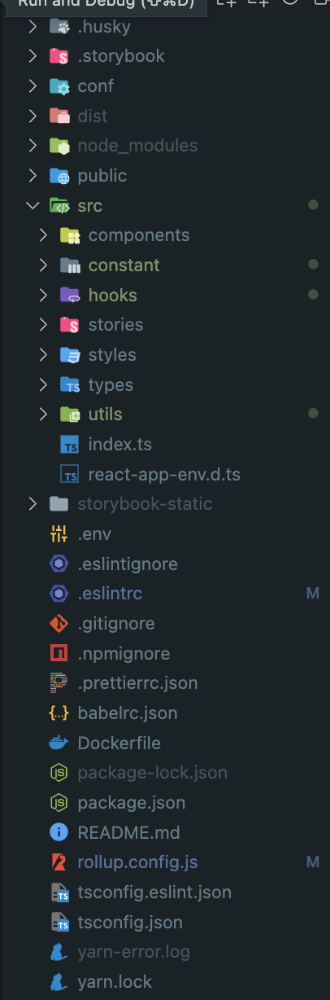

# UI 라이브러리를 만들어보자

# 시작하게 된 이유

이직한 회사에서 백오피스를 전담으로 프로젝트를 진행하고 있다. 처음에는 하나의 프로젝트에 앱과 관련된 관리를 위한 백오피스만 존재하였으나

점차 기획단에서 이 UI들을 기반으로 다른 용도 또는 다른 프로젝트의 백오피스를 찍어내길 원하셨고 코드를 계속해서 복사 붙여넣기하는 것은

추후에 싱크를 맞추는데 상당히 애를 먹는다는 것을 진즉 깨달은 탓에 모노레포나 npm에 라이브러리를 배포해서 이를 해결해야한다는 것을 생각했다.

모노레포는 전 회사에서 경험을 해보았을 때 폴더구조가 너무 커지는것이 개인적으로 부담되어 시도해보지 않은 라이브러리화를 진행해보자고 생각하고 진행하였다.

# 1. 구성요소

일단 어떤것을 라이브러리에 집어넣고 공통으로 사용할지에 대한 고민이 제일 우선시 되어야했지만 그게 후순위가 되어서 최근에 이를 정했다..

작성한 코드들은 대부분 Component + hooks로 예를 들어 기간선택을 하는 컴포넌트인 PeriodSelector.tsx가 존재하면 usePeriodSelector라는 훅을 만들어

이 컴포넌트를 활용하기 위해 사용되는 state, setter등을 넣어놓고 코드 중복을 최대한 줄이는 방식으로 진행했다.

그렇다면 컴포넌트만 라이브러리에 넣을게 아니라 hooks도 넣어줘야 한다고 생각했고 이렇게 진행을 하였다.

아래 예시를 보면 이해가 편하니 잠깐 코드를 봐보자.

```tsx
const PeriodSelector: React.FC<IPeriodSelectorProps> = ({
  selectTime,
  //...생략
}): JSX.Element => {
  return (
    <WrapperDate>
      <span>{labelText || '기간 선택'}</span>
      <div>
        <div>
          <Calendar date={startDate} handleDate={handleStartDate} />
          {withTimes && handleTime && selectTime && (
            <input
              type="time"
              value={selectTime && selectTime[0]}
              name="startTime"
              onChange={handleTime}
            />
          )}
        </div>
        <span>~</span>
        <div>
          <Calendar date={endDate} handleDate={handleEndDate} />
          {withTimes && handleTime && selectTime && (
            <input
              type="time"
              value={selectTime && selectTime[1]}
              name="endTime"
              onChange={handleTime}
            />
          )}
        </div>
      </div>
    </WrapperDate>
  );
};

export default React.memo(PeriodSelector);
```

편의를 위해 import, style, props들을 생략하였다.
이런식의 기본적인 컴포넌트가 있으면 handleTime, selectTime과 같은 값들은 hooks를 통해 생성되어 결합되도록 만들었다.

아래 hooks를 보자

```javascript


export const PeriodContext = createContext<IPeriodContext | undefined>(
  undefined,
);

const usePeriodSelector = (defaultDate: [Date, Date] = [PREV_MONTH, TODAY]) => {
  const [date, setDate] = useState<[Date, Date]>(defaultDate);
  const [selectTime, setSelectTime] = useState(['00:00', '00:00']);
  const [assembleDate, setAssembleDate] = useState<[Date, Date]>([
    new Date(),
    new Date(),
  ]);

  const handleStartDate = (startDate: Date) => {
    setDate([startDate, date[1]]);
  };

  const handleEndDate = (endDate: Date) => {
    setDate([date[0], endDate]);
  };

  const handleTime = (e: React.ChangeEvent<HTMLInputElement>) => {
    const { name, value } = e.currentTarget;
    if (name === 'startTime') {
      setSelectTime([value, selectTime[1]]);
    }
    if (name === 'endTime') {
      setSelectTime([selectTime[0], value]);
    }
  };

  const initializeDate = () => {
    setDate([PREV_MONTH, TODAY]);
    setSelectTime(['00:00', '00:00']);
  };

  useEffect(() => {
    const { startModifed, endModified } = dateAndTimeAssemble({
      startDate: date[0],
      startTime: selectTime[0],
      endDate: date[1],
      endTime: selectTime[1],
    });

    setAssembleDate([startModifed, endModified]);
  }, [date, selectTime]);

  const state = {
    date,
    assembleDate,
    selectTime,
  };

  const actions = {
    setDate,
    setSelectTime,
    initializeDate,
    handleStartDate,
    handleEndDate,
    handleTime,
  };

  const periodContextValue = { state, actions };

  return {
    state: {
      date,
      assembleDate,
      selectTime,
    },
    actions: {
      setDate,
      setSelectTime,
      initializeDate,
      handleStartDate,
      handleEndDate,
      handleTime,
    },
    periodContextValue,
  };
};

export default usePeriodSelector;
```

편의를 위해 utils, constant, import는 생략하였다.

위와 같이 필요한 로직들과 state, context들을 미리 hooks에 선언해놓고 사용하는 방식으로 진행하였다.

# 2. 번들링

결론부터 말하면 라이브러리와 훅을 임포트해서 사용하기 위한 번들링 툴은 `rollup.js`를 사용하였다.

스토리북으로 static하게 컴포넌트들을 보여주는 것과 동시에 hook과 component들을 import해서 사용하는 것이 목적이었기 때문인데 여기서 시행착오가 있었다.

초반에는 익숙한 webpack을 통해 번들링을 진행하려 하였으나 `storybook-cli`를 통해 스토리북 번들링을 사용할 목적이었고 웹팩의 세팅을 건들게 되면

이러한 지원을 활용할 수 가 없게 되어 다른 번들링 툴을 찾게 된 것이다.

물론 웹팩으로 두가지 다 세팅하면 번들링 툴 하나를 줄일 수 있게 되지만 그럴 시간과 실력이 안되었으므로 따로 번들링을 시키기로 결정하고 rollup.js를 활용하기로 마음 먹었다.

## 2.1 컴포넌트와 훅 번들링하기

아래 config 파일을 우선 먼저 보고 하나씩 뜯어 설명을 봐보자

```javascript
import commonjs from '@rollup/plugin-commonjs';
import rollupJson from '@rollup/plugin-json';
import resolve, { nodeResolve } from '@rollup/plugin-node-resolve';
import replace from '@rollup/plugin-replace';
import typescript from '@rollup/plugin-typescript';
import babel from 'rollup-plugin-babel';
import peerDepsExternal from 'rollup-plugin-peer-deps-external';
import postcss from 'rollup-plugin-postcss';
import { terser } from 'rollup-plugin-terser';

export default [
  {
    // for calendar.css

    input: 'src/index.ts',
    output: {
      dir: 'dist',
      format: 'cjs',
      sourcemap: true,
      exports: 'named',
      preserveModules: true,
    },

    plugins: [
      // peerDepsExtenral plugin automatically make external list in rollup.config by refering peerDepenencies in pakcage.json
      peerDepsExternal(),
      resolve({ jsnext: true, preferBuiltins: true, browser: true }),
      commonjs(),
      // for replacing origin process to string
      // Need do write process.env.sth as string not as process method

      replace({
        preventAssignment: true,
        values: {
          'process.env.UI_API_ENDPOINT': 'http://15.164.231.190:8081',
          'process.env.UI_KAKAO_MAP_KEY': '3f6bc37442403680a61d253d2d3c5efc',
          'process.env.UI_TOKEN_NAME': 'oa-token',
        },
      }),
      typescript({ tsconfig: './tsconfig.json', declarationDir: 'dist' }),
      postcss({
        modules: true,
        extract: false,
        minimize: true,
        // use:['sass']
      }),
      nodeResolve({
        extensions: ['.css'],
      }),
      babel({ include: ['./src/**/*'] }), // Babel을 사용 할 수 있게 해줌
      rollupJson(),
      terser(),
    ],
    // external: ['react', 'react-dom', 'styled-components'],
  },
];
```

### 2.1.1 peerDepsExternal

package.json에 존재하는 `peerDependencies`의 라이브러리를 제외하고 번들링을 실행해준다.

<!-- 이를 사용한 이유는 라이브러리를 install해서 사용하는곳에 이미 해당 라이브러리들이 존재할 것이고 라이브러리를 번들링할때
이 라이브러리들을 함께 번들링해주면, 번들링된 패키지를 설치해서 사용하는 곳에서 두개의 라이브러리 인스턴스가 존재하며 충돌이 생기기 때문이다. -->

peerDependencies의 목적은 해당 패키지를 받아서 사용하는 곳에 이 패키지 사용을 위해서는 이러한 의존들이 필요하다는 것을 알려주는 용도이고
번들링 시에는 이 라이브러리들을 제외하고 번들링을 시켜준다.

이 라이브러리들을 그냥 dependencies에 넣게되면 받아쓰는 곳에서 해당 라이브러리와 동일한 라이브러리의 instance가 `node_modules` 트리에 꼬이며 여러가지 존재하는 것을 막기 위해서이다.

아래는 UI-library에서 `package.json`에 `peerDependencies`에 존재하는 것이다.

리액트 프로젝트에서 이 라이브러리를 사용하는 것이 목적이므로 기존 프로젝트에서 사용하고 있는 라이브러리 중 인스턴스가 생기면 안되는것들로 넣어줬다.
`react-query` 를 사용하고 있다면 이 또한 넣어주는 것이 좋다.

또한 이 라이브러리를 사용하면 위에 주석으로 처리되어있는 external에 들어있는 리스트들을 직접 타이핑 하는 것이 필요없어진다.
라이브러리 자체로 peerDependencies를 external로 넣어주게 된다.

```json
  "peerDependencies": {
    "axios": "^0.27.2",
    "react": "^17.0.2",
    "react-dom": "^17.0.1",
    "styled-components": "^4.4.1",
    "styled-reset": "^4.3.4"
  },
```

### 2.1.2 @rollup/plugin-node-resolve

엔트리포인트와 어떤방식으로 번들을 할건지 설정해주는 라이브러리다.
`preferBuiltins`는 내장모듈(fs, path)등의 로컬모듈을 선호할 건지에 대한 옵션이고 default가 true 이다.

browser는 브라우저에 번들로 묶어 사용할 용도인 경우 사용하게 되며 default가 false 이다.

사용하려면 mainfields옵션에 browser를 추가해야하는데 없으면 그냥 무시된다. 나중을 위해 true로 일단 만들어 놨다.

원래 jsnext옵션도 있었는데 이제 사용안된다고 해서 그냥 날렸다.

### 2.1.2 @rollup/plugin-commonjs

node_modules의 패키지가 js모듈이 아닌 레거시의 commonJs로 지원될 확률이 높기 때문이 commonJS를 사용하여 잘못된 번들을 방지하기 위해 사용하게 된다.

### 2.1.3 @rollup/plugin-replace

이 플러그인은 타겟된 string을 원하는 값으로 바꿔주는 역할을 하게 되며
나는 process.env에 기존에 사용하던 값들을 여기서 변경해주는 역할을 하기 위해 사용하였다.

### 2.1.4 @rollup/plugin-typescript

ts번들링을 하기 위해 사용하였다. 간단하게 tsconfig의 위치와 어디에 번들될지에 대한 설정만 해두고 버전에 대한 설정을 남겨두었다.

### 2.1.5 rollup-plugin-postcss

css를 번들링하여 index.html의 헤드에 넣거나, 모듈화 하여 사용할 수 있게 해주는 번들링 툴이다.

Calendar 컴포넌트를 `react-datepicker`라이브러리를 이용하여 만들었는데 커스터마이징을 위해 `.css` 파일이 필요하여
이를 처리하기 위해 사용하였다.

따로 모듈로 빼내지 않고 js로 inject하는 방식을 활용하기 위해 nodeResolve도 사용해야했다 (필요하다고 하니까..)

module화는 시키지만 따로 css로 extract를 하지않아 .module.css파일이 생기지 않고 minimize를 통해 불필요한 css를 제거한다.

```javascript
  postcss({
    modules: true,
    extract: false,
    minimize: true,
  }),
```

### 2.1.6 @rollup/plugin-json

package.json을 불러와서 버전을 알아내고 하는 용도로 사용하기 위해 넣어놨었는데 필요가 없어졌지만 내버려두고 있다.

### 2.1.7 rollup-plugin-terser

얘는 번들링 된 파일의 용량을 최소화하기 위해서 사용하는 플러그인이다.
코멘트(주석)을 지우거나 등의 옵션이 가능하다.

## 2.2 tsconfig

```json
// For bundling
{
  "compilerOptions": {
    "esModuleInterop": true,
    "strict": true,
    "skipLibCheck": true,
    "jsx": "react",
    "module": "ESNext",
    "declaration": true,
    "declarationDir": "types",
    "sourceMap": true,
    "outDir": "dist",
    "moduleResolution": "node",
    "emitDeclarationOnly": true,
    "allowSyntheticDefaultImports": true,
    "forceConsistentCasingInFileNames": true,
    "plugins": [{ "name": "typescript-plugin-css-modules" }]
  },
  "exclude": [
    "dist",
    "node_modules",
    "src/**/*.test.tsx",
    "src/**/*.stories.tsx"
  ]
}
```

```json
// For linting
{
  // ...same
  "exclude": ["dist", "node_modules", "src/**/*.test.tsx"]
}
```

주요하게 볼 부분만 설명을 더하면 될 것 같다(귀찮은게 절 대 아님)
plugins에 `typescript-plugin-css-modules` 를 지정해놓았는데 이 역할은 css모듈을 사용할 경우 클래스를 IDE에서 잡을 수 있게 도와주는 역할이다.

린트용에서는 exclude에 stroybook이 없는것을 볼 수 있는데 storybook파일에 tsconfig의 린트를 걸면 난장판이 되기때문에 빼줫다.

그래서 `.eslintrc`의 옵션은 아래와 같이 가리키게 되고

```json
"parserOptions": { "project": "./tsconfig.eslint.json" },
```

rollup의 config를 보면 아래와 같이 가리키게 된다.

```json
typescript({ tsconfig: './tsconfig.json', declarationDir: 'dist' }),
```

## 2.3 babelrc.json

```json
{
  "presets": [["react-app", { "flow": false, "typescript": true }]],
  "plugins": ["babel-plugin-styled-components"]
}
```

styled-components를 위한 바벨 플러그인을 추가해줬다.
flow는 주석을 통해 타입을 확인하게 해주는 것인데 ts를 쓰므로 필요가 없어 false이다.

이렇게 React Component, Hooks, css를 번들링하기 위한 세팅이 끝났다.

# 3. 폴더구조



여러명이서 작업을 할 것으로 예상이 되어 간단하게 husky를 사용해 lint를 커밋전에 먼저 돌리게 설정해놓았다.

스토리북의 번들링은 Docker파일을 설정해놓아 CI/CD에 사용되고 스토리북과 실제 작성된 컴포넌트 간의 린트 조절을 위해
tsconfig를 린트용과 실제 번들링용으로 별도로 두었다.

아무래도 2편으로 나눠서 작업을 해야할 것 같다..

다음편에는 npm에 호스팅을 하고 실제로 어떤방식으로 에러를 잡으면서 작업을 해야하는지에 관해 포스팅하고

만들어놓은 공통 컴포넌트를 어떻게 storybook에서 활용하는지를 포스팅해야겠다.

1편 끝!

## 참고

- [npm/peer-dependencies](https://nodejs.org/es/blog/npm/peer-dependencies/)
  참고 추후 추가 예정..
